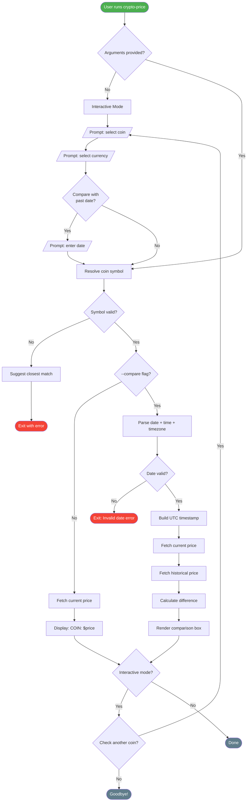
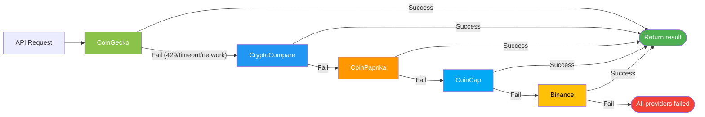

# crypto-price-cli

```
                                ___________
                               /           \
                              /    $ $ $    \
                             |   ₿  ◈  ◎    |
                              \    $ $ $    /
                               \___________/
                                    |||
                                    |||
        ┌─────────────────────────────────────────────────┐
        │                                                 │
        │    ██████╗██████╗ ██╗   ██╗██████╗ ████████╗    │
        │   ██╔════╝██╔══██╗╚██╗ ██╔╝██╔══██╗╚══██╔══╝   │
        │   ██║     ██████╔╝ ╚████╔╝ ██████╔╝   ██║      │
        │   ██║     ██╔══██╗  ╚██╔╝  ██╔═══╝    ██║      │
        │   ╚██████╗██║  ██║   ██║   ██║        ██║      │
        │    ╚═════╝╚═╝  ╚═╝   ╚═╝   ╚═╝        ╚═╝      │
        │                                                 │
        │            ██████╗ ██████╗ ██╗ ██████╗███████╗  │
        │            ██╔══██╗██╔══██╗██║██╔════╝██╔════╝  │
        │            ██████╔╝██████╔╝██║██║     █████╗    │
        │            ██╔═══╝ ██╔══██╗██║██║     ██╔══╝    │
        │            ██║     ██║  ██║██║╚██████╗███████╗  │
        │            ╚═╝     ╚═╝  ╚═╝╚═╝ ╚═════╝╚══════╝  │
        │                                                 │
        │       ₿ Bitcoin    ◈ Ethereum    ◎ Solana        │
        │       ▲ +3.59%     ▼ -1.82%     ▲ +12.4%        │
        │                                                 │
        └─────────────────────────────────────────────────┘

   Track crypto prices & compare with historical data — right from your terminal.
             5 free APIs · 39 coins · Interactive REPL · Zero config
```

> **One command. Real-time prices. Historical comparison. No API key needed.**

## Installation

### From npm (after publishing)

```bash
npm install -g crypto-price-cli
```

### From source

```bash
git clone https://github.com/denysfedorov/denysfedorov.git
cd denysfedorov/crypto-cli
npm install
npm run build
npm link
```

After either method, `crypto-price` is available globally in your terminal.

## Quick Start

```bash
# Interactive mode — just launch and follow the prompts
crypto-price

# Check current BTC price
crypto-price btc

# Compare ETH price with a past date (uses current time of day)
crypto-price eth --compare 2026-03-25

# Compare with a specific time and timezone
crypto-price eth --compare 2026-03-25 --time 20:00+02:00

# Use a different fiat currency
crypto-price sol --compare 2025-01-15 --currency eur
```

## Usage

```
Usage: crypto-price [options] [symbol]

Check crypto prices and compare with historical data

Arguments:
  symbol                     Coin symbol (e.g. btc, eth, sol)

Options:
  -V, --version              output the version number
  -c, --compare <date>       Compare with price on YYYY-MM-DD
  -t, --time <time>          Time for comparison (e.g. 20:00+02:00, 18:00Z, 14:30)
  --currency <code>          Fiat currency code (default: usd)
  -h, --help                 display help for command
```

### Running without arguments — Interactive Mode

When you run `crypto-price` with no arguments, you enter an interactive session:

```
$ crypto-price

  Crypto Price Checker

? Select a cryptocurrency: (Use arrow keys)
❯ BTC (Bitcoin)
  ETH (Ethereum)
  SOL (Solana)
  BNB (BNB)
  XRP (XRP)
  ADA (Cardano)
  DOGE (Dogecoin)
  DOT (Polkadot)
  AVAX (Avalanche)
  LINK (Chainlink)
  Other (type manually)

? Select currency:
❯ USD ($)
  EUR (€)
  GBP (£)
  JPY (¥)
  CAD (C$)
  AUD (A$)

? Compare with a historical date? Yes
? Enter date (YYYY-MM-DD): 2026-03-20

┌───────────────────────────────────────────────┐
│  ETH (Ethereum)                               │
├───────────────────────────────────────────────┤
│  Current price:    $2,045.32                  │
│  Price on 2026-03-20:  $1,987.65              │
│  Difference:       +$57.67 (+2.90%) ▲         │
│  Compare time:     Mar 20, 2026 at 14:32 UTC  │
└───────────────────────────────────────────────┘

? Check another coin? (Y/n)
```

### Current price only

```
$ crypto-price btc

BTC (Bitcoin): $67,432.18
```

### Price comparison

```
$ crypto-price eth --compare 2026-03-25

┌───────────────────────────────────────────────┐
│  ETH (Ethereum)                               │
├───────────────────────────────────────────────┤
│  Current price:    $2,085.50                  │
│  Price on 2026-03-25:  $2,012.30              │
│  Difference:       +$73.20 (+3.64%) ▲         │
│  Compare time:     Mar 25, 2026 at 21:40 UTC  │
└───────────────────────────────────────────────┘
```

### Price comparison with specific time and timezone

```
$ crypto-price eth --compare 2026-03-25 --time 20:00+02:00

┌───────────────────────────────────────────────┐
│  ETH (Ethereum)                               │
├───────────────────────────────────────────────┤
│  Current price:    $2,085.50                  │
│  Price on 2026-03-25:  $2,008.75              │
│  Difference:       +$76.75 (+3.82%) ▲         │
│  Compare time:     Mar 25, 2026 at 18:00 UTC  │
└───────────────────────────────────────────────┘
```

The `--time` option accepts these formats:

| Format           | Meaning                        | Example           |
|------------------|--------------------------------|-------------------|
| `HH:MM`          | Time in UTC                    | `14:30`           |
| `HH:MMZ`         | Explicit UTC                   | `14:30Z`          |
| `HH:MM+OO:OO`   | Time with positive UTC offset  | `20:00+02:00`     |
| `HH:MM-OO:OO`   | Time with negative UTC offset  | `10:00-05:00`     |

### Different currency

```
$ crypto-price sol --compare 2025-01-15 --currency eur

┌──────────────────────────────────────────────┐
│  SOL (Solana)                                │
├──────────────────────────────────────────────┤
│  Current price:    €142.50                   │
│  Price on 2025-01-15:  €98.30                │
│  Difference:       +€44.20 (+44.96%) ▲       │
│  Compare time:     Jan 15, 2025 at 18:00 UTC │
└──────────────────────────────────────────────┘
```

## Supported Cryptocurrencies

The tool supports 39 popular coins out of the box:

| Symbol | Name              | Symbol | Name              |
|--------|-------------------|--------|-------------------|
| btc    | Bitcoin           | ltc    | Litecoin          |
| eth    | Ethereum          | etc    | Ethereum Classic  |
| sol    | Solana            | xlm    | Stellar           |
| bnb    | BNB               | algo   | Algorand          |
| xrp    | XRP               | near   | NEAR Protocol     |
| ada    | Cardano           | ftm    | Fantom            |
| doge   | Dogecoin          | icp    | Internet Computer |
| dot    | Polkadot          | fil    | Filecoin          |
| avax   | Avalanche         | hbar   | Hedera            |
| matic  | Polygon           | vet    | VeChain           |
| link   | Chainlink         | sand   | The Sandbox       |
| uni    | Uniswap           | mana   | Decentraland      |
| atom   | Cosmos            | axs    | Axie Infinity     |
| aave   | Aave              | arb    | Arbitrum          |
| mkr    | Maker             | op     | Optimism          |
| crv    | Curve DAO         | apt    | Aptos             |
| ldo    | Lido DAO          | sui    | Sui               |
| ton    | Toncoin           | sei    | Sei               |
| trx    | TRON              | shib   | Shiba Inu         |
| pepe   | Pepe              |        |                   |

Mistyped a symbol? The tool will suggest the closest match:

```
$ crypto-price btcc
✖ Unknown coin "btcc". Did you mean "btc"?
```

## Supported Currencies

USD, EUR, GBP, JPY, CAD, AUD — and any fiat currency code supported by CoinGecko (pass via `--currency`).

## Error Messages

The tool provides clear, human-friendly errors:

| Scenario                      | Output                                                           |
|-------------------------------|------------------------------------------------------------------|
| Unknown coin symbol           | `✖ Unknown coin "xyz". Did you mean "xrp"?`                     |
| Invalid date format           | `✖ Invalid date format. Use YYYY-MM-DD.`                        |
| Future date                   | `✖ Date cannot be in the future.`                                |
| Today's date                  | `✖ That's today — nothing to compare. Pick a past date.`        |
| No internet                   | `✖ Can't reach price API. Check your internet connection.`      |
| API rate limited              | `✖ Rate limited. Wait 60 seconds and try again.`                |
| Coin didn't exist on that date| `✖ No price data for PEPE. The coin may not have existed yet.`   |

## Development

```bash
# Run in dev mode (no build needed)
npm run dev -- btc

# Run tests
npm test

# Run tests in watch mode
npm run test:watch

# Type check
npx tsc --noEmit

# Build for production
npm run build
```

## Data Sources

The tool automatically cycles through multiple free APIs. If one provider is down, rate-limited, or unreachable, it falls back to the next one — no configuration needed.

| Priority | Provider     | API Key | Rate Limit         | Currencies | Notes                          |
|----------|-------------|---------|--------------------|-----------|---------------------------------|
| 1        | [CoinGecko](https://www.coingecko.com/en/api)   | No      | ~30 req/min        | All fiat  | Best historical data           |
| 2        | [CryptoCompare](https://min-api.cryptocompare.com/) | No  | ~100K req/month    | All fiat  | Direct timestamp lookup        |
| 3        | [CoinPaprika](https://api.coinpaprika.com/)      | No      | ~1,000 req/day     | USD only  | 1yr daily historical (free)    |
| 4        | [CoinCap](https://docs.coincap.io/)              | No      | 200 req/min        | USD only  | 15-min interval historical     |
| 5        | [Binance](https://binance-docs.github.io/apidocs/) | No    | 1,200 req/min      | USD/EUR/GBP | 1h kline historical         |

The output shows which provider served the data:

```
BTC (Bitcoin): $67,432.18 via CoinGecko
```

```
┌───────────────────────────────────────────────┐
│  ETH (Ethereum)                               │
├───────────────────────────────────────────────┤
│  Current price:    $2,085.50                  │
│  Price on 2026-03-25:  $2,008.75              │
│  Difference:       +$76.75 (+3.82%) ▲         │
│  Compare time:     Mar 25, 2026 at 18:00 UTC  │
│  Data source:      CoinGecko                  │
└───────────────────────────────────────────────┘
```

**How fallback works:**
1. Tries CoinGecko first (best data quality, supports all currencies)
2. If CoinGecko fails (429 rate limit, timeout, network error), tries CryptoCompare
3. If CryptoCompare fails, tries CoinPaprika
4. If CoinPaprika fails, tries CoinCap
5. If CoinCap fails, tries Binance
6. If all fail, shows a combined error message

Non-USD currencies will skip providers that only support USD (CoinPaprika, CoinCap) and try the next one automatically.

## Architecture

### High-Level Flow

```
User runs crypto-price
        │
        ▼
┌─────────────────┐     ┌──────────────────────┐
│  Has arguments?  │─No─▶│  Interactive Mode     │
│  (symbol given)  │     │  Prompt: coin,        │
└───────┬─────────┘     │  currency, date       │
        │ Yes            └──────────┬───────────┘
        ▼                           │
┌─────────────────┐                 │
│  Resolve symbol  │◀───────────────┘
│  btc → bitcoin   │
└───────┬─────────┘
        │
        ▼
┌─────────────────┐     ┌──────────────────────┐
│  --compare flag? │─No─▶│  Fetch current price  │──▶ Display result
└───────┬─────────┘     └──────────────────────┘
        │ Yes
        ▼
┌─────────────────┐     ┌──────────────────────┐
│  Parse date      │───▶│  Fetch current price   │
│  + time/timezone │     │  + historical price   │
└─────────────────┘     └──────────┬───────────┘
                                   │
                                   ▼
                        ┌──────────────────────┐
                        │  Calculate diff       │
                        │  Format & render box  │
                        └──────────────────────┘
```

### Mermaid Flowchart



### Provider Fallback Chain



### Project Structure

```
crypto-cli/
├── src/
│   ├── index.ts                    # CLI entry point (commander setup)
│   ├── types.ts                    # Error classes & shared interfaces
│   ├── commands/
│   │   ├── price.ts                # Direct CLI command handler
│   │   └── interactive.ts          # Interactive REPL mode
│   ├── services/
│   │   ├── api.ts                  # Fallback orchestrator
│   │   ├── httpErrors.ts           # Shared Axios error handler
│   │   ├── coinMap.ts              # Symbol → CoinGecko ID mapping
│   │   └── providers/
│   │       ├── types.ts            # PriceProvider interface
│   │       ├── coingecko.ts        # Provider #1
│   │       ├── cryptocompare.ts    # Provider #2
│   │       ├── coinpaprika.ts      # Provider #3
│   │       ├── coincap.ts          # Provider #4
│   │       └── binance.ts          # Provider #5
│   └── utils/
│       ├── date.ts                 # Date parsing & timezone handling
│       ├── format.ts               # Price formatting & diff calculation
│       └── display.ts              # Terminal output with chalk
├── tests/
│   ├── coinMap.test.ts
│   ├── date.test.ts
│   └── format.test.ts
├── bin/
│   └── crypto-price.js             # Global bin entry point
├── package.json
└── tsconfig.json
```

## License

ISC
